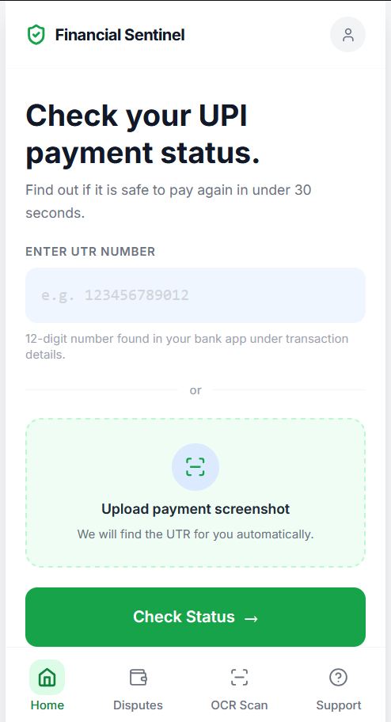
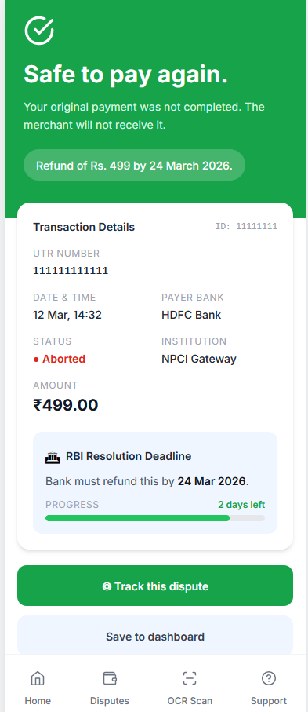

# Financial Sentinel
> Know before you pay again.

**Check the status of any failed UPI payment in under 30 seconds. Know instantly whether it is safe to pay again.**


---

## Live Demo

**[financial-sentinel-8qpe.vercel.app](https://financial-sentinel-8qpe.vercel.app)**

> Note: The backend runs on Render's free tier and may take 20-30 seconds to wake up on the first request. If the status check seems slow initially, wait a moment and try again.




---

## The Problem

You scan a QR code at a store. You enter your UPI PIN. The app says "failed" or "pending." The merchant's screen shows nothing. There is a queue behind you.

Do you pay again and risk a duplicate charge? Or do you wait and risk the merchant cancelling?

Right now, no tool answers this clearly.

---

## What This Tool Does

Enter your UTR number (or upload a screenshot — the tool extracts it automatically) and get back:

- A clear **GREEN / YELLOW / RED** recommendation on whether to pay again
- The exact reason your transaction failed
- The **RBI-mandated deadline** by which your bank must resolve it
- A **pre-filled escalation template** if your bank has breached that deadline

---

## Status Logic

| Status | Colour | Meaning |
|---|---|---|
| Safe to pay again | GREEN | Transaction failed or was aborted. Merchant will never receive this payment. |
| Do not pay yet | YELLOW | Transaction is still in-flight. Paying again risks a duplicate charge. Wait 10 minutes. |
| Do not pay again | RED | Transaction was successful. Merchant has received the funds. |

> The counterintuitive insight: a transaction where money was debited but aborted is still GREEN. The merchant will never receive it. You must pay again. The refund will arrive within RBI-mandated timelines.

---

## Demo UTR Numbers

| UTR | Status | Scenario |
|---|---|---|
| `111111111111` | GREEN | Transaction aborted, refund in progress |
| `222222222222` | YELLOW | Transaction in-flight at NPCI switch |
| `333333333333` | RED | Transaction confirmed successful |
| `444444444444` | GREEN | Timeout, auto-reversal initiated |
| `555555555555` | YELLOW | Deemed approved, manual review |
| `666666666666` | GREEN | Debited but aborted (most critical scenario) |

---

## Features

- UTR lookup via manual input or screenshot OCR (Google Vision API)
- Pay-again recommendation with plain-English explanation
- RBI TAT deadline tracker with breach detection
- Pre-filled escalation templates for bank grievance portal and RBI Ombudsman
- Dispute dashboard with deadline tracking
- Retry button with 30-second cooldown and unlimited checks for YELLOW status

---

## Tech Stack

| Layer | Technology |
|---|---|
| Frontend | React 18, Tailwind CSS, Vite |
| Routing | React Router v6 |
| Backend | Python, FastAPI |
| OCR | Google Vision API (mock in demo) |
| Deploy | Vercel (frontend), Render (backend) |

---

## Running Locally

### Prerequisites
- Node.js 18+
- Python 3.11+

### Frontend

```bash
cd frontend
npm install
npm run dev
```

Open `http://localhost:5173`

### Backend

```bash
cd backend
python3 -m venv venv
source venv/bin/activate        # Windows: venv\Scripts\activate
pip install -r requirements.txt
cp .env.example .env
uvicorn main:app --reload --port 8000
```

API runs at `http://localhost:8000`
API docs at `http://localhost:8000/docs`

Create a `frontend/.env` file with:
```
VITE_API_URL=http://localhost:8000
```

---

## Project Artefacts

| Artefact | Link |
|---|---|
| Live Demo | [financial-sentinel-8qpe.vercel.app](https://financial-sentinel-8qpe.vercel.app) |
| Backend API | [financial-sentinel-backend.onrender.com/docs](https://financial-sentinel-backend.onrender.com/docs) |
| Full PRD | [PRD.md](./PRD.md) |
| Figma Prototype | [View on Figma Community](https://www.figma.com/community/file/1617089372118422150) |
| Medium Write-up | _Coming soon_ |

---

## Regulatory Reference

RBI TAT mandates referenced in this product are sourced from RBI circular **DPSS.CO.OD No.629/06.08.005/2019-20**. The TAT reference table in the product was last updated in March 2026.

---

## Why I Built This

Most Indians have been there. You are at a medical store, a restaurant, or a petrol pump. You scan the QR code, enter your PIN, and the app returns "failed" or "pending." The merchant is waiting. There is a queue behind you. You have no idea if the money left your account or not.

You call customer care. You get a ticket number. You wait.

This happens tens of millions of times every month across India. UPI processes over 17 billion transactions a month, and even at a sub-1% failure rate that is a staggering number of people left confused, anxious, and without any guidance on the single most important question in that moment: is it safe to pay again?

No bank app answers this. No payment app answers this. The information exists in the system — it is just never surfaced to the person who needs it most.

Financial Sentinel is an attempt to fix that.


---

*Built by [Ayush Jha](https://linkedin.com/in/ayush-jha-iitj) — Product Manager, IIT Jodhpur*
